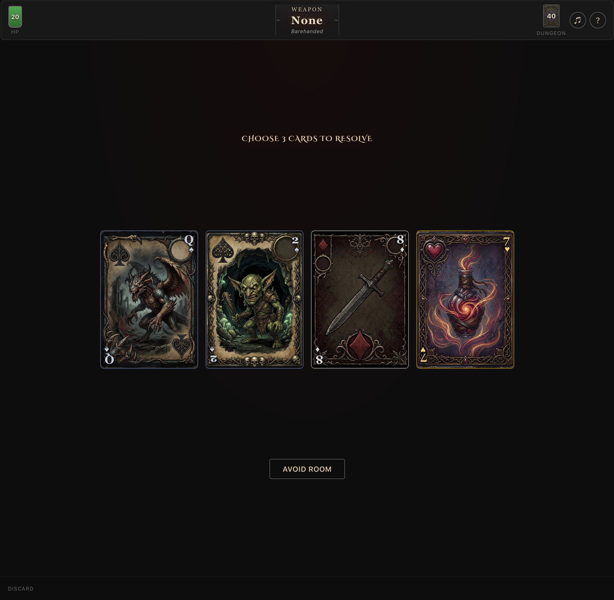

# Scoundrel

A solo dungeon-crawling card game built with vanilla HTML, CSS, and JavaScript. No frameworks, no dependencies — just open `index.html` and play.

**[Play it live](https://diegoborgh.github.io/scoundrel-game/)**



## Rules

You descend into a dungeon represented by a deck of 44 cards. Your goal: survive by clearing every card. Your score equals your remaining HP.

### Card Types

| Type | Suits | Effect |
|------|-------|--------|
| **Monsters** | Clubs, Spades | Deal damage equal to their face value (J=11, Q=12, K=13, A=14) |
| **Weapons** | Diamonds 2–10 | Equip to reduce monster damage. Replaces your current weapon |
| **Potions** | Hearts 2–10 | Heal HP (max 20). Only one potion heals per room |

### Each Turn

1. Four cards are drawn into a **Room**.
2. **Avoid:** Put all 4 cards on the bottom of the deck. You cannot avoid two rooms in a row, and you cannot avoid after picking a card.
3. **Face:** Resolve 3 of 4 cards in any order. The remaining card carries over to the next room.

### Combat

- Without a weapon, you take full monster damage.
- With a weapon, damage = monster value - weapon value (minimum 0).
- A weapon can only fight monsters with value ≤ the last monster it defeated (no limit if unused).

## Features

- Dark fantasy card art with unique illustrations per suit
- Procedural 8-bit audio — all sound effects and music generated via Web Audio API (no audio files)
- Title screen music, victory fanfare, and defeat march
- Fireworks celebration on victory with score count-up and flavor text
- Responsive design — works on desktop and mobile
- Desktop: hover to preview card effects, click to resolve
- Mobile: tap to select and preview, tap again to resolve
- Keyboard controls: number keys (1–4) to select cards, `A` to avoid

## Tech Stack

- **HTML/CSS/JS** — zero dependencies
- **Web Audio API** — procedural sound synthesis
- **Canvas API** — fireworks particle effects
- **Google Fonts** — Cinzel Decorative for the medieval display type

## Project Structure

```
index.html        — Game markup and screens
styles.css        — All styling and responsive breakpoints
game.js           — Game logic, audio, rendering, and event handling
assets/           — Card art and favicon
```

## Development

Open `index.html` in a browser. No build step required.

### Dev Console Helpers

After entering the dungeon, open the browser console for testing tools:

- `devWin()` — Trigger the victory screen
- `devLose()` — Trigger the defeat screen
